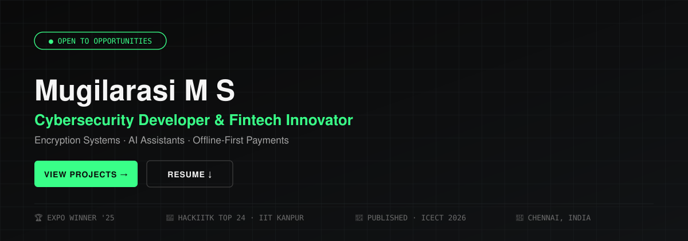

 

 

## About me

Security-driven developer specializing in **encryption systems and fintech innovation**. Architect of **ZeroNetPay**, a cross-platform offline UPI payment app using HMAC-SHA256 encryption and biometric authentication. I work across full-stack development (Python, FastAPI), cryptography (AES, RSA, HKDF), and privacy-first system design.

Final-year B.E. Computer Science student at **Velammal Engineering College, Chennai** (CGPA 8.45, 2023–2027).

 

### Experience

**Cybersecurity & Development Intern** — Insprisys & MotionCut *(Remote)* · Dec 2023 – Jan 2025
Secure system architecture, encryption and threat-mitigation strategies for real-world cybersecurity projects.

**Automation & Testing Intern** — Royal Enfield Headquarters *(Onsite)* · Dec 2025
Automated the cluster testing suite for Flying Flea (Royal Enfield's EV), documented 30+ edge cases, and implemented automated regression testing.

 

### Featured projects

<table>
<tr>
<td width="50%" valign="top">

**🛰️ [ZeroNetPay](https://github.com/Mugilarasi04)** — *Niral Hackathon (under review)*
 
Founder & Lead Developer. Offline UPI payment layer using HMAC-SHA256 signed tokens, QR transfer, and biometric auth — enabling digital payments with zero connectivity.

</td>
<td width="50%" valign="top">

**🔐 [Proteus Encryption](https://github.com/Akshay-07-hash/Proteus--proto)**
 
Multi-layer encryption system with Dynamic Permutation Generation, AEAD, and a deception-based Honey Engine. Published at **ICECT 2026** (ISBN 978-93-5737-886-4).

</td>
</tr>
<tr>
<td width="50%" valign="top">

**📤 [FadeDrop](https://github.com/Mugilarasi04/Fadedrop-file)**
 
Zero-knowledge encrypted file sharing — hybrid AES/Fernet + RSA model, QR-based access, expiry tokens and password protection.

</td>
<td width="50%" valign="top">

**🎙️ [ENCOM Voice Assistant](https://github.com/Mugilarasi04/encom)**
 
Always-listening AI assistant with custom voice trigger, emergency dial system, and a Jarvis-inspired interface.

</td>
</tr>
</table>

 

### Hackathons & achievements

| | |
|---|---|
| 🚀 | **HackIITK (C3iHub)** — Top 24 teams, CTF Track, IIT Kanpur |
| 🛰️ | **Niral Hackathon** — ZeroNetPay, Founder & Lead Developer *(under review)* |
| 🏆 | **Department Project Expo** — Winner (2025) |
| 🥉 | **IGKO Zonal** — 3rd Place (SOF) |
| 📄 | **Research Publication** — *Proteus Encryption System*, ICECT 2026 |

 

### Leadership

**Technical Head, Youth Red Cross (YRC)** — Velammal Engineering College
Contributed towards YRC services from 2023–2026, supporting the society's technical initiatives and outreach programs alongside coursework.

 

### Tech stack

 

 

📌 Latest posts and updates: <a href="https://www.linkedin.com/in/mugilarasims04/">linkedin.com/in/mugilarasims04</a>

Built with ♥ in Chennai, India

